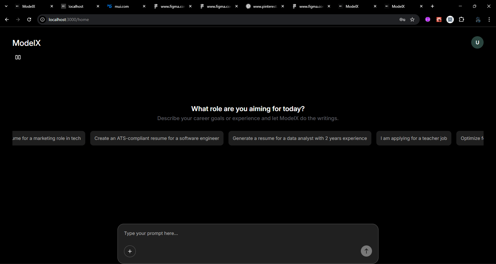

# 🧠 ModelX – AI-Powered Resume Builder

ModelX is an intelligent resume generation platform designed to help users craft high-quality, ATS-friendly resumes through simple prompts. Whether you're a developer, marketer, designer, or fresh graduate, ModelX helps you translate your experience into professional resumes tailored to your goals.


---

## 📌 Demo Link

🔗 [Visit Live App](https://model-x-sandy.vercel.app)

> ⚠️ **Note**: This is a *demo version*. Resume generation is not fully functional yet. Full functionality is under development.

---

## 🔒 Disclaimer

> **This project is not open source. All rights reserved.**
>
> The ModelX source code is licensed under a custom license and is intended for **showcasing purposes only**. Unauthorized use, distribution, or reproduction of this codebase is strictly prohibited.

---

## 📷 Screenshots




---

## 🚀 Features

- ⚡ AI-powered resume generation from natural language prompts
- 📄 Customizable resume templates and themes
- 💾 Save, bookmark, and organize multiple resumes
- 💬 Interactive chat workspace for guided resume building
- 🌗 Light & Dark theme toggle for better accessibility
- 📁 Auto-save and export in PDF format (coming soon)
- 👤 User authentication and personalized settings
- 🛠️ Settings for privacy, notifications, appearance, and language

## 🧪 Demo Flow (in development)

Currently, the resume generation is in demo mode. When a user submits their first prompt, they receive a guided message flow:
1. ✍️ Acknowledge the prompt
2. 👤 Ask for the user's name
3. ⚠️ Send a demo resume with a notice that full features are still in development

## 🧱 Tech Stack

- **Frontend:** React.js (with React Router and Context API)
- **UI Library:** Material UI (MUI)
- **Styling:** MUI Theme System + Styled Components
- **State Management:** `useContext` + `useReducer`
- **Animations:** Framer Motion
- **Deployment:** Vercel
- **Mock Database:** Local mock data (planned MongoDB + Express integration)

## 📂 Folder Structure

src/
├── assets/           # Images, logos
├── components/       # Reusable UI components
├── context/          # Global state (e.g. settings)
├── data/             # Mock resume DB
├── pages/            # App routes (Home, Auth, PromptDashboard, etc.)
├── theme.js          # Dynamic theme configuration
└── App.js            # Route config


## 🛠️ Installation (For authorized testers or contributors)

```bash
git clone https://github.com/yourusername/modelx.git
cd modelx
npm install
npm start

```
## 👤 Author

Prosper Emmanuel – Frontend Developer
💼 Built with ❤️ as a portfolio-grade real-world application

---

## ✅ `LICENSE`

```txt
MIT License (Modified for Commercial Restriction)

Copyright (c) 2025 Prosper Emmanuel

Permission is hereby granted to view and clone this repository for educational and personal use only. Commercial use, redistribution, or modification of any part of the ModelX project without explicit written permission from the author is strictly prohibited.

THE SOFTWARE IS PROVIDED "AS IS", WITHOUT WARRANTY OF ANY KIND, EXPRESS OR IMPLIED. IN NO EVENT SHALL THE AUTHORS BE LIABLE FOR ANY CLAIM, DAMAGES, OR OTHER LIABILITY ARISING FROM THE USE OF THIS SOFTWARE.
```
